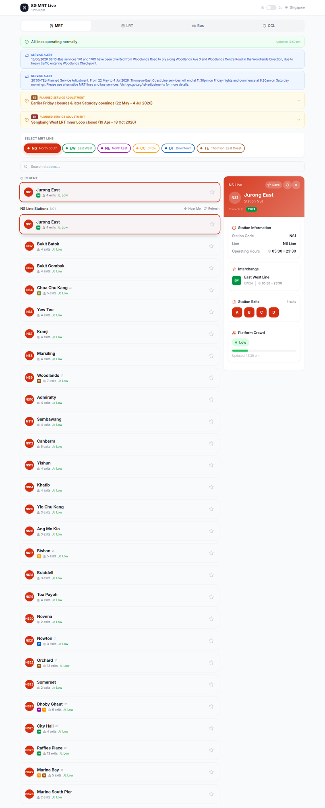
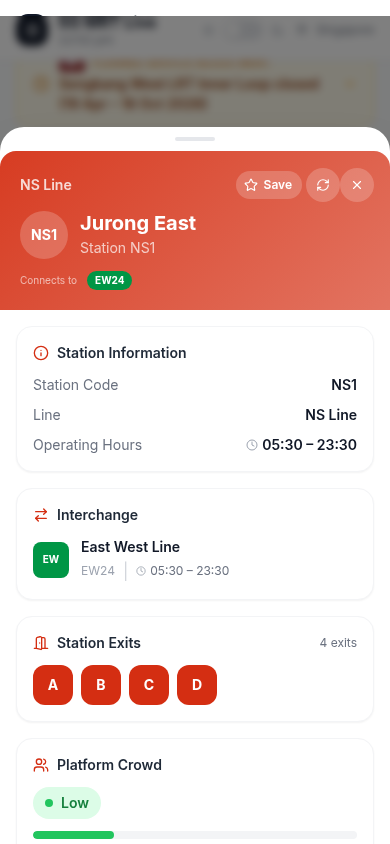
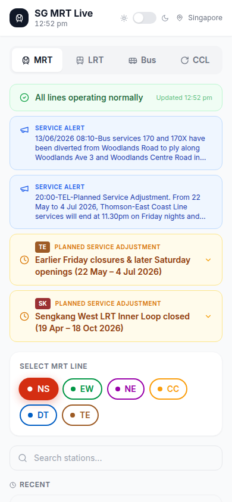
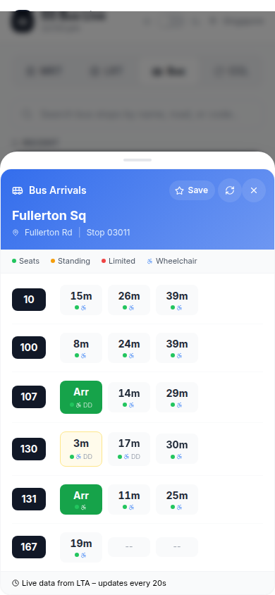

<div align="center">

# 🚆 SG MRT Live

### Real-time Singapore MRT · LRT · Bus arrivals, crowd levels & service alerts

<p>
  
  
  
  
  
</p>

<p>
  
  
  
  
</p>

<br />

<!-- ───────────────  MAIN SHOWCASE  ─────────────── -->


<br /><br />

<em>A fast, glanceable transit companion for daily Singapore commuters — built on the official LTA DataMall feed.</em>

</div>

---

## 📖 Overview

**SG MRT Live** turns Singapore's official **LTA DataMall** real-time feeds into a clean, mobile-first web app that answers the three questions a commuter actually has on the platform:

> **"When is my train/bus coming?"**, **"How packed is it?"**, and **"Is anything disrupted?"**

It covers all **MRT** and **LRT** lines plus the full bus network, with geolocation-powered *"near me"* discovery, favourites & recents, station exit/landmark guidance, and a dedicated **Circle Line CCL6** wayfinding guide for the new full-loop service.

The **LTA API key never reaches the browser** — every request is proxied through a Supabase Edge Function that holds the key server-side. The UI is engineered to **fail soft**: when LTA hiccups, it holds the last-known status with a freshness note instead of lying or going blank.

<table>
<tr>
<td width="33%" valign="top">

#### ⚡ Real-time
Live train & bus arrivals, crowd density, and service alerts — polled on independent timers.

</td>
<td width="33%" valign="top">

#### 📍 Location-aware
Nearest stations & bus stops by walking distance, with one-tap favourites and recents.

</td>
<td width="33%" valign="top">

#### 🌙 Night-ready
Full dark mode with AA-contrast tokens, tuned for low-light underground commuting.

</td>
</tr>
</table>

---

## 🧩 Feature Deep-Dive

The app is built around **three core real-time modules**, each backed by a distinct LTA DataMall endpoint and a fail-soft frontend state.

<br />

### 1️⃣ MRT/LRT Crowd Status

> Per-station platform density, normalized into a three-level traffic-light ring.



| Aspect | Detail |
| :--- | :--- |
| **Data source** | LTA DataMall → `PCDRealTime` (real-time platform crowd density) |
| **Proxy** | Supabase Edge Function, `action=crowd`, one `TrainLine` per request, fetched in parallel |
| **Refresh** | Polls every **60 s**; manual refresh available |
| **Component behaviour** | `useCrowdData()` normalizes LTA's inconsistently-cased `CrowdLevel` (`l`/`m`/`h`/`na`) into canonical lowercase so a missed key can never crash a card. Rendered as a colored ring on `StationCard` and a labelled density bar in `StationDetail`. |
| **States** | 🟢 **Low** · 🟠 **Moderate** · 🔴 **High** · ⚪ **No data** (badge hidden, never a crash) |

<br />

### 2️⃣ Live Service Alerts

> Network-wide disruption, planned-works, and incident messaging — with a fail-soft banner.



| Aspect | Detail |
| :--- | :--- |
| **Data source** | LTA DataMall → `TrainServiceAlerts` (+ curated planned-disruption list) |
| **Proxy** | Supabase Edge Function, `action=alerts` |
| **Refresh** | Polls every **30 s** |
| **Component behaviour** | `useTrainAlerts()` tracks `everLoaded` / `stale` / `lastUpdated`. On a failed poll it **keeps the last good status** and flags it stale rather than flipping to a false "unavailable". `AlertsBanner` renders four states. |
| **States** | 🔴 **Disruption** card · 🟢 **All lines normal** + "Updated HH:MM" · 🟠 **Couldn't refresh** (last-known held) · 🟠 **Unavailable** (only when never loaded) |

<br />

### 3️⃣ Bus Arrival Timings

> Next-three-bus countdown per stop, with load and accessibility indicators.



| Aspect | Detail |
| :--- | :--- |
| **Data source** | LTA DataMall → `v3/BusArrival` (live) + `BusStops` (static directory) |
| **Proxy** | Supabase Edge Function, `action=bus_arrival` / `action=bus_stops` |
| **Refresh** | Polls every **20 s** — matched to LTA's own feed cadence |
| **Component behaviour** | `useBusArrivals()` computes minutes-until from each absolute `EstimatedArrival` timestamp (clamped at 0 → **"Arr"**, never negative). `BusArrivalBoard` shows load dots, wheelchair-accessible (WAB) and double/bendy type tags, with **skeleton rows** while loading and a **fail-soft** "showing last known timings" note on a failed refresh. |
| **States** | **Arr** (≤1 min) · **N min** · **--** (untracked) · skeleton (loading) · retry prompt (no data) |

---

## 🎨 UI/UX Pro Max — Architecture & Design

The interface follows the **UI/UX Pro Max** design intelligence for a *Public Transit Guide* product type: **flat, touch-first, content-dense, and accessibility-led.**

### Typography

| Role | Font | Rationale |
| :--- | :--- | :--- |
| **Headings & body** | **Inter** (400 / 500 / 600 / 700) | Highly legible neutral sans, optimized for UI and small sizes — ideal for glanceable transit data |
| **Numerics** | Inter + `tabular-nums` | Tabular figures on every live timer & clock so digits **don't shift width** as they tick down |

### Color System — *semantic tokens*

The verified **"Public Transit Guide"** palette is wired as Tailwind tokens (`tailwind.config.js`) so dark/light contrast is defined once, not per-screen:

| Token | Hex | Use |
| :--- | :--- | :--- |
| `transit-primary` | `#2563EB` | Brand blue · bus board header · focus rings |
| `transit-secondary` | `#0891B2` | LRT / secondary accents |
| `transit-accent` | `#EA580C` | Call-to-action |
| `transit-muted` | `#64748B` | Secondary text — **passes 4.5:1 on both white and gray-900** |
| `transit-danger` | `#DC2626` | Disruptions / errors |

**Crowd status rings** use a fixed traffic-light scale, kept consistent across the card and detail views:

```
🟢  Low        #16a34a   (¼ bar)
🟠  Moderate   #d97706   (½ bar)
🔴  High       #dc2626   (full bar)
⚪  No data    #6b7280   (badge hidden)
```

### Night-time / underground contrast choices

- **Full dark mode** (`darkMode: 'class'`) — every surface, border, and text token has a paired dark variant; **not** an inverted light theme.
- Secondary text uses **`gray-500` / `transit-muted`** (≈4.6:1), never the failing `gray-400` (~2.8:1).
- Modal & bottom-sheet **scrims at 50% black** to fully isolate foreground content in low light.
- **`prefers-reduced-motion`** respected globally; **44×44px** minimum touch targets; visible keyboard focus rings.

<br />

### 🛰️ Real-time Data Flow

How the live LTA feeds flow through the secure proxy into isolated frontend states:

```
                                  ┌──────────────────────────────┐
                                  │        LTA DataMall API       │
                                  │  PCDRealTime · TrainAlerts ·  │
                                  │   v3/BusArrival · BusStops    │
                                  └───────────────┬──────────────┘
                                                  │  AccountKey (server-side only)
                                                  ▼
                                  ┌──────────────────────────────┐
                                  │   Supabase Edge Function      │
                                  │   (Deno · mrt-arrivals)       │
                                  │   • holds LTA_API_KEY         │
                                  │   • CORS allowlist + JWT      │
                                  └───────────────┬──────────────┘
                                                  │  anon key (public by design)
                                                  ▼
            ┌─────────────────────────────────────────────────────────────────┐
            │                      React Frontend  (fetchLTA)                   │
            │                                                                   │
            │   useCrowdData ──60s──▶  crowdMap   ──▶  StationCard / Detail     │
            │   useTrainAlerts ─30s─▶  alert state ─▶  AlertsBanner (fail-soft) │
            │   useBusArrivals ─20s─▶  arrivals    ─▶  BusArrivalBoard          │
            │   useGeolocation ─────▶  position    ─▶  Nearest stations / stops │
            │                                                                   │
            │   Each hook polls independently and degrades to last-known data   │
            └─────────────────────────────────────────────────────────────────┘
```

> **Security note:** the LTA key lives **only** in the Edge Function's `Deno.env`. The browser authenticates to the function with the Supabase **anon key**, which is public by design. The key is never bundled into the frontend.

---

## 🛠️ Installation & Dev Server Setup

### Prerequisites

- **Node.js 18+**
- A **Supabase** project (for the edge-function proxy)
- An **LTA DataMall** API key — [request one here](https://datamall.lta.gov.sg/content/datamall/en/request-for-api.html)

### 1 · Clone & install

```bash
git clone https://github.com/evanisacoder26/singapore-transport-live-application.git
cd singapore-transport-live-application
npm install
```

### 2 · Configure environment

```bash
cp .env.example .env
```

```env
VITE_SUPABASE_URL=https://YOUR-PROJECT.supabase.co
VITE_SUPABASE_ANON_KEY=your-supabase-anon-key
```

> ⚠️ The **LTA key is NOT placed in `.env`** — it's a server-side Edge Function secret:
> ```bash
> supabase secrets set LTA_API_KEY=your-lta-datamall-key
> supabase secrets set ALLOWED_ORIGINS=http://localhost:5173,https://your-domain.com
> supabase functions deploy mrt-arrivals
> ```

### 3 · Start the dev server

```bash
npm run dev
```

Open **http://localhost:5173** — Vite serves with hot-module reload.

### 📜 Scripts

| Command | Description |
| :--- | :--- |
| `npm run dev` | Start the Vite dev server (HMR) |
| `npm run build` | Type-check + production build to `dist/` |
| `npm run preview` | Preview the production build locally |

---

<div align="center">

### 🙏 Data & Attribution

Real-time data © **[Land Transport Authority of Singapore](https://datamall.lta.gov.sg/)** via LTA DataMall.<br />
Exit/landmark references cross-checked with **[Land Transport Guru](https://landtransportguru.net/)**.<br />
An independent project — not affiliated with or endorsed by the LTA.

<br />

**[⬆ Back to top](#-sg-mrt-live)** · Licensed under [MIT](./LICENSE)

</div>
